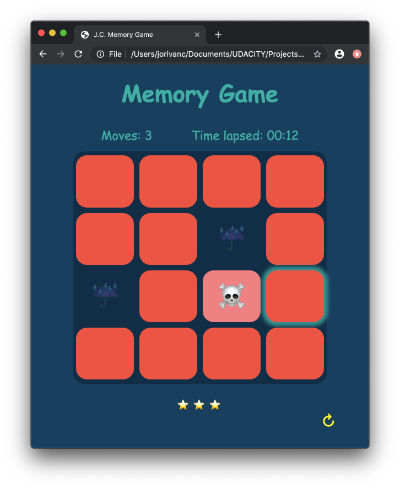

# Memory-Game
Browser-based card matching game (also known as Concentration)



## How to play.
1. CLick/Open a card.
2. Open another card. If they match, then return to step 1.  Otherwise remember the cards previously opened and try to find pairs of matching cards.
3. Now do this until all the cards have been opened in the minimum amount of moves and time.

## Future Improvements.
- Implement a _Settings_ option:
  * Add the option to set a countdown timer. (just as a challenge for the player)
  * Let the user set a difficulty level (pick the number of cards). See **Note.**
- Implement keyboard accessibility.
- Improve the way the rating is calculated. Right now the star rating is calculated solely on the amount of moves. It would be better to also take into account the time spent solving the game.
- Implement a Score Panel: Allow users to input their names and record their scores and display a panel with those result ordered from best to ..... not so good.


#### Note
The function loadCardsToHtml allows to load a series/array of cards of any length to the board. So it would be possible to allow players to select the amount of cards (set the difficulty) to play, as long as there are an even number of cards.
```
function loadCardsToHtml(series){
  let msgHTML = "";
  for ( let card of series) {
    msgHTML += `<li data-type="${card.symbolDescription}" class="card face__down" alt="${card.symbolDescription}"> ${card.symbol} </li> \n`;
  }
  board.innerHTML = msgHTML;
}//end loadCardsToHtml
```
To test this feature simply comment out 2n cards from scrips.js
```
let cards = [];
cards[0] = new card('🍺', 'beer');
cards[1] = new card('🍺', 'beer');
// 2n cards commented out
...
```
## Specifications met
1. Memory Game logic
2. Congratulations Popup
3. Restart button
4. Star rating
5. Timer
6. Moves Counter
7. Styling
8. Responsiveness
9. Comments
10. README
